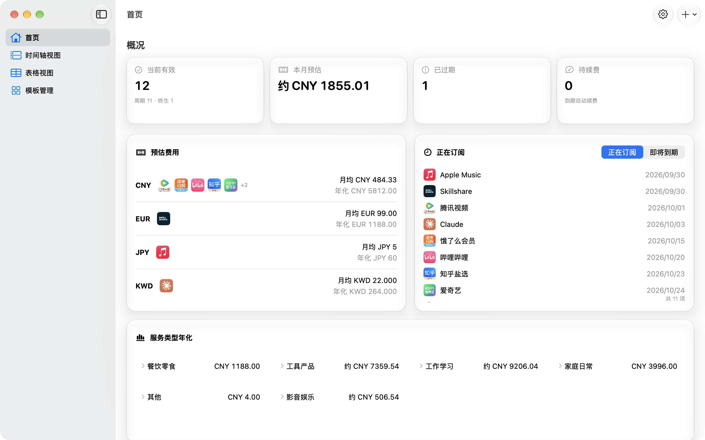
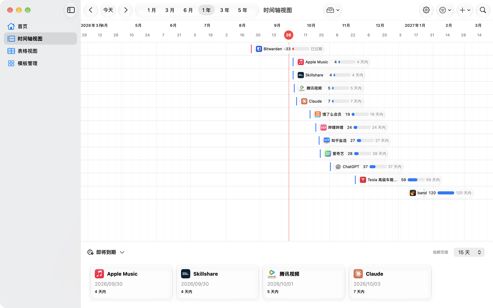
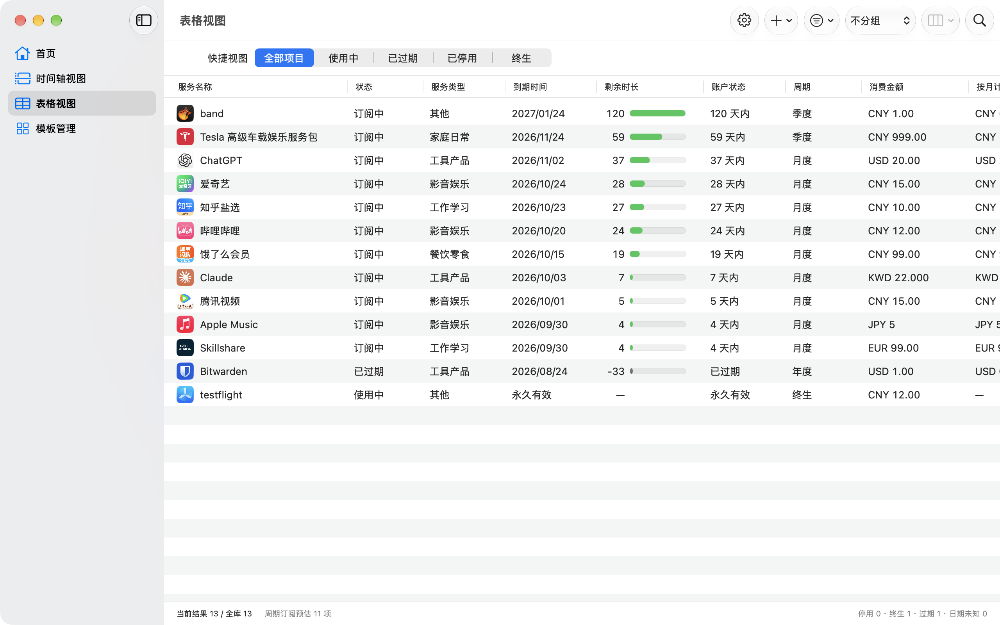
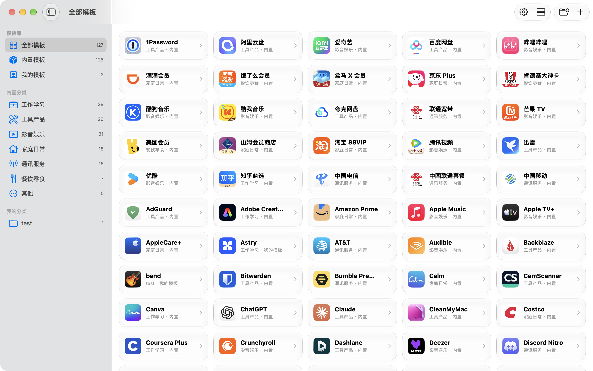

<div align="center">
  

# Periodic

**原生、离线优先的 macOS 订阅管理工具**

集中管理软件订阅、会员服务与终生购买，清楚看到何时到期、每月大约花多少，以及实际支付过什么。

macOS 26+ · 简体中文 / English

</div>

## 适合谁

Periodic 面向希望手动管理订阅，又不想连接银行账户或把财务信息交给在线服务的个人用户。当前价格、使用周期与实际付款分开记录，费用预估不会覆盖付款历史。

- **提前看到续费节点**：集中查看临期、过期和待确认续费的项目。
- **看懂长期成本**：分别汇总不同币种的月均与年化预估。
- **保留真实历史**：调价或修改订阅资料不会改写既有付款记录。
- **快速整理大量项目**：通过搜索、筛选、排序、分组和模板完成日常维护。

## 界面预览

<table>
  <tr>
    <th width="50%">首页</th>
    <th width="50%">时间轴视图</th>
  </tr>
  <tr>
    <td></td>
    <td></td>
  </tr>
  <tr>
    <th>表格视图</th>
    <th>模板管理</th>
  </tr>
  <tr>
    <td></td>
    <td></td>
  </tr>
</table>

## 核心能力

| 领域 | 你可以做什么 |
| --- | --- |
| 订阅管理 | 新建、编辑、复制、停用、恢复和删除项目；支持月度、季度、半年、年度与终生类型 |
| 到期与提醒 | 查看临期和过期项目、接收系统通知，并在续费后更新下一周期 |
| 费用概览 | 按币种分别查看月均与年化预估，不混合不同币种 |
| 周期与付款 | 按年份查看使用周期和实际付款，并可补录或修正历史 |
| 浏览方式 | 通过首页概览、连续时间轴和可筛选表格查看同一份数据 |
| 模板与图标 | 使用内置服务模板，或建立自己的模板、分类与图标 |
| 备份与迁移 | 导出 `.periodicdata` 数据包；导入前先校验和预览，再合并现有数据 |
| 个性化 | 跟随系统/浅色/深色外观，简体中文/English，常用货币与时间轴默认范围 |

## 本地优先与隐私

Periodic 无需账号，日常使用无需联网。

- 订阅、付款历史、自定义模板和图片均保存在本地。
- 不包含遥测或广告，不会读取银行账单，也不会代替用户发起付款。
- 只有在你主动搜索品牌图标或使用汇率换算时才会联网；请求不会包含订阅名称、金额或备注。
- 导入与导出通过系统文件选择器完成；`.periodicdata` 数据包未加密，请像保护账单一样妥善保管。

当前版本不提供 iCloud 同步或 AI 助手。

## 安装与运行

当前仓库提供源码构建方式，暂未发布经过签名和公证的安装包。

### 系统要求

- macOS 26.0 或更高版本
- 从源码构建时需要支持 macOS 26 SDK 的 Xcode

### 从源码运行

```bash
git clone https://github.com/occva/Periodic.git
cd Periodic
./script/build_and_run.sh
```

脚本会构建 Debug 版本并启动应用。若只想体验界面而不读写正式数据库，可运行：

```bash
./script/build_and_run.sh --sample-data
```

样本模式使用内存数据库，退出应用后数据自动丢弃。

也可以直接用 Xcode 打开 `Periodic.xcodeproj`，选择 `Periodic` scheme 后运行。

## 开发

Periodic 使用 Swift 6 严格并发检查，界面基于 SwiftUI 和 macOS 26 Liquid Glass，持久化采用 SwiftData；系统通知由 UserNotifications 管理。

```bash
# 单元测试（默认跳过独立性能测试）
./script/test.sh unit

# UI 测试
./script/test.sh --ui

# 完整常规测试
./script/test.sh --all

# 独立性能基线测试
./script/test.sh --performance
```

更多工程说明：

- [产品需求](docs/requirement.md)
- [架构说明](docs/architecture.md)
- [实现设计](docs/implementation/)

## 许可

本项目基于 [GNU General Public License v3.0](LICENSE) 发布。
